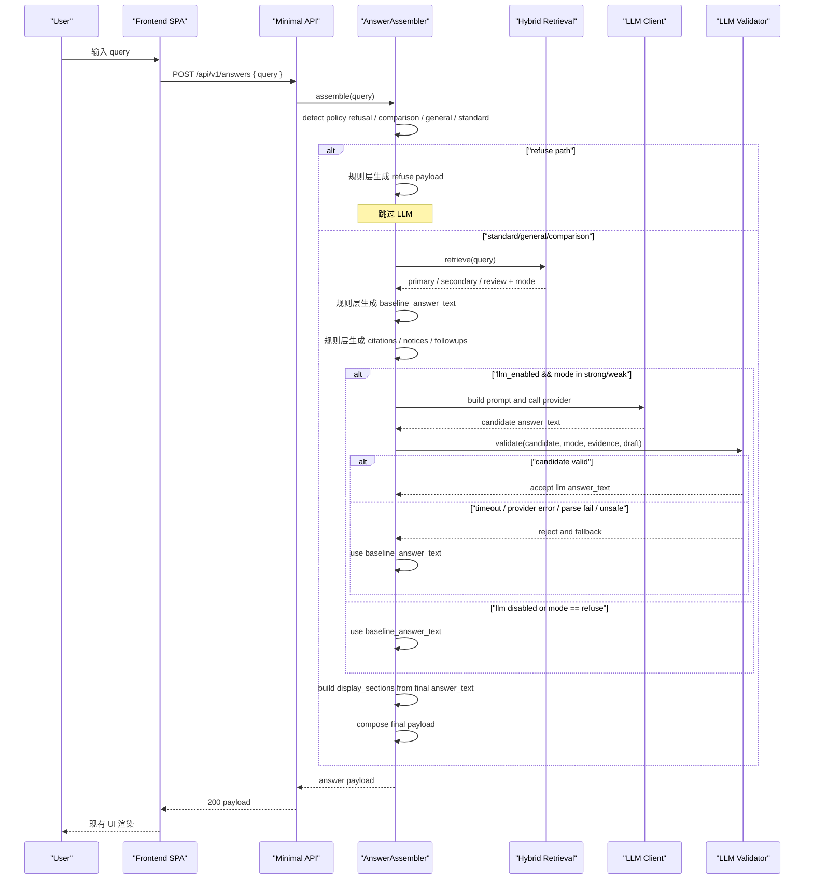

# 最小真实 LLM API 接入时序 v1

- 文档日期：2026-04-09
- 文档用途：把 `minimal_llm_api_integration_spec_v1.md` 中的接入顺序、判定点与回退点串成实现时序

## 1. 总时序



## 2. 关键判定点

### 2.1 Mode 判定先于 LLM

冻结顺序：

1. 先 retrieval
2. 先 gating
3. 先 `answer_mode`
4. 再决定是否调用 LLM

不能反过来做成：

1. 先调 LLM
2. 再由 LLM 决定 strong / weak / refuse

原因是这样会直接破坏当前 evaluator v1 和 evidence policy 的稳定性。

### 2.2 LLM 只碰 `answer_text`

在时序里，LLM 调用发生时，以下对象已经定稿：

1. `answer_mode`
2. `primary_evidence`
3. `secondary_evidence`
4. `review_materials`
5. `citations`
6. `review_notice`
7. `refuse_reason`
8. `suggested_followup_questions`

LLM 唯一可变更的是：

1. `answer_text`

以及由此连带的：

1. `display_sections.answer.summary`

## 3. refuse 路径时序

refuse 路径必须完全 deterministic：

```text
detect policy refusal / no-evidence refusal
  -> answer_mode = refuse
  -> answer_text = 当前统一拒答话术
  -> refuse_reason = 规则层生成
  -> suggested_followup_questions = 规则层生成
  -> citations = []
  -> skip LLM
```

为什么 refuse 不接 LLM：

1. 论文收益低
2. 风险高
3. 当前统一拒答结构已经稳定
4. 这条路径最不需要“更自然的表达”

## 4. strong / weak 路径时序

### 4.1 Baseline 先生成

无论是 standard、general 还是 comparison，先用当前规则层生成：

1. `baseline_answer_text`
2. `answer_mode`
3. evidence slots
4. citations

### 4.2 再尝试 LLM 改写

LLM 调用不是替代 baseline，而是：

1. 读取 `baseline_answer_text`
2. 读取 query
3. 读取 evidence slots
4. 读取 mode
5. 输出一个候选 `answer_text`

### 4.3 最终二选一

最终只会返回两种来源之一：

1. `llm_answer_text`
2. `baseline_answer_text`

不会返回“半成功混合态”，也不会把 LLM 输出拆进其他字段。

## 5. Prompt 组装时序

Prompt 组装顺序冻结为：

```text
system instruction
  -> answer_mode
  -> user_query
  -> draft_answer
  -> primary_evidence
  -> secondary_evidence
  -> review_materials
  -> hard_constraints
  -> output_format(JSON)
```

注意：

1. 不放 retrieval score
2. 不放 rerank score
3. 不放 record_id
4. 不放 raw trace
5. 不开多轮、不做二次校验 prompt

## 6. 失败回退时序

### 6.1 Provider 失败

```text
call provider
  -> network / auth / rate limit / 5xx / timeout
  -> log fallback reason
  -> use baseline_answer_text
  -> continue payload assembly
```

### 6.2 输出解析失败

```text
provider returns text
  -> JSON parse fail
  -> log parse failure
  -> use baseline_answer_text
```

### 6.3 输出越界

```text
provider returns candidate answer_text
  -> validator detects unsafe / mode drift / weak cue missing / structure loss
  -> reject candidate
  -> use baseline_answer_text
```

### 6.4 为什么不向前端暴露 LLM 失败

本版不新增前端分支，所以：

1. 前端始终收到同一 payload contract
2. LLM 失败只影响 answer_text 来源，不影响接口语义
3. 调试信息只写日志和 smoke artifact

## 7. Smoke / Regression 时序

建议的验证顺序：

```text
1. 不开 LLM 跑现有 smoke，确认 baseline 未回归
2. 开 LLM 跑 5 条最小 smoke
3. 开 LLM 复跑 evaluator v1 on goldset 150
4. 对比 mode_match / citation_basic_pass / failure_count
```

最重要的回归点：

1. `answer_mode` 不变
2. evidence slots 不变
3. citations 不变
4. `refuse` 不被 LLM 接管
5. strong / weak 的 answer_text 要么是合格 LLM 输出，要么是 baseline fallback

## 8. 实现节拍建议

最小实现轮次建议按下面顺序推进：

1. 先加 LLM config 和 disabled-by-default 开关
2. 先在 `AnswerAssembler` 里接 baseline -> LLM -> validator -> fallback 的单点闭环
3. 先跑 5 条 smoke
4. 再复跑 150 evaluator
5. 最后再决定要不要调 prompt 文案

不要反过来先调 prompt、先扩 provider、先改前端。
