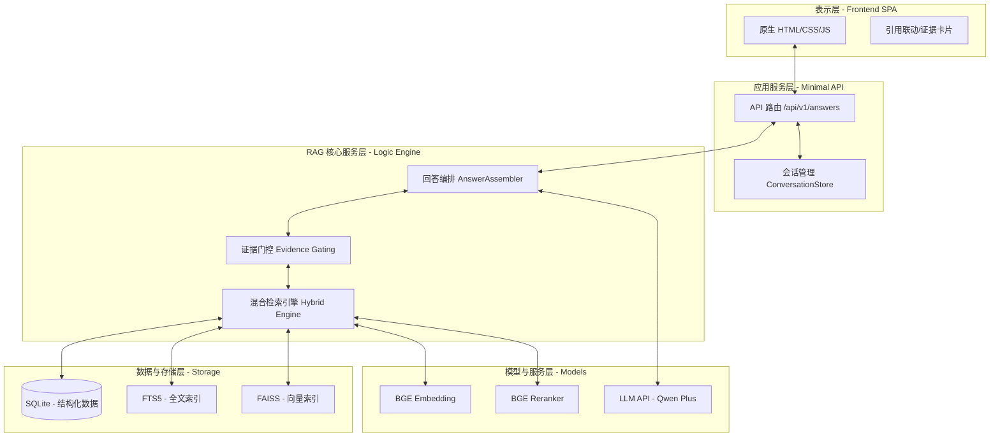
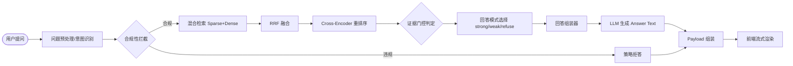
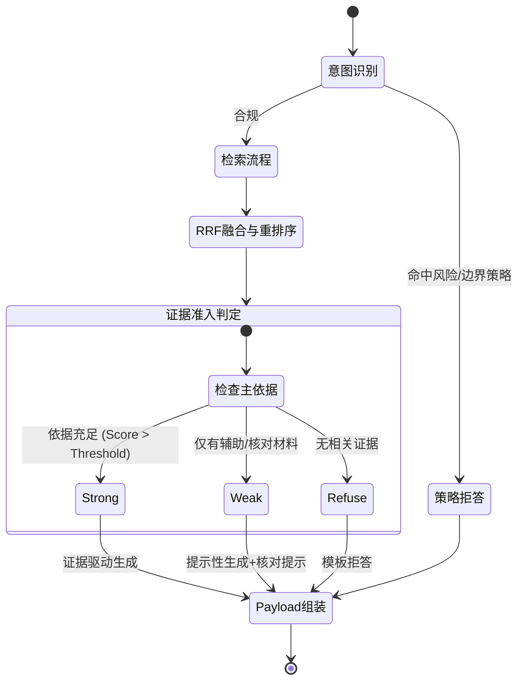

# 第4章 系统设计

## 4.1 系统设计目标与原则

### 4.1.1 设计目标
本系统的核心目标是构建一个面向《伤寒论》单书场景的检索增强生成（RAG）支持系统，旨在为中医经典研读提供可信、可追溯、且具备边界控制能力的智能化辅助工具。不同于通用的医疗诊断系统或临床决策支持系统，本系统专注于“原文研读”这一细分领域，通过现代汉语提问与经典中医条文之间的语义对齐，实现对中医经典文献的深度检索与结构化解读。

具体设计目标包括：
1. **高可信性的证据召回**：系统需确保召回的每一条证据均来源于权威的《伤寒论》版本（如《四部丛刊初编》本《注解伤寒论》），避免大语言模型（LLM）由于训练数据污染或模型幻觉而生成的伪造条文。
2. **严密的证据分层门控**：根据证据与用户问题的相关度、权威性及语境完整性，将检索结果划分为主依据、补充依据及核对材料，建立前置的证据准入机制。
3. **基于规则的回答模式控制**：通过预定义的业务逻辑（如 strong、weak_with_review_notice、refuse），在生成回答前判定当前证据是否足以支撑可靠结论，实现对回答边界的精准控制。
4. **全链路的引用溯源**：在生成的自然语言回答中，必须嵌入与后端检索 ID 绑定的引用标注，并与前端交互联动，确保用户能够“一键溯源”到原始条文与注解。

### 4.1.2 设计原则
为了实现上述目标，系统在架构与功能设计上遵循以下原则：
1. **可信性原则（Credibility）**：坚持“证据驱动生成”，将 LLM 的角色限定为证据片段的组织者而非知识的创造者。在证据不足时，系统应优先选择“拒答”或“风险提示”而非强行生成。这种原则的核心在于“尊重原文”，确保系统输出不偏离中医经典文献的本意。
2. **可追溯性原则（Traceability）**：所有输出内容必须有据可查。从检索出的原始 Chunk 到最终的 Answer Text，每一环节均保留元数据跟踪，支持从前端 UI 到数据库底座的完整溯源路径。用户不仅是答案的接收者，更是证据的核验者。
3. **边界控制原则（Boundary Control）**：针对中医经典的特殊性，设置明确的拒绝策略（Policy Refusal）。对于涉及现代医疗诊断、个人健康建议或跨领域问题的查询，系统应触发预设的拒答逻辑。这一原则有效地规避了中医古籍在现代应用中的伦理与安全风险。
4. **轻量化与可部署性原则（Lightweight）**：前端采用原生 HTML/CSS/Vanilla JS 实现，后端使用轻量级的原生 Python HTTP 服务，降低系统对复杂框架的依赖，提升在多种环境下的部署稳定性。
5. **可评测性原则（Evaluability）**：设计闭环的评测体系，通过构建高质量的 Goldset 黄金测试集，对召回率、回答模式准确率及引用标注准确性进行定量评估。

## 4.2 系统总体架构设计

本系统采用分层架构设计，共分为表示层、应用服务层、RAG 核心服务层、模型与外部服务层以及数据与存储层。这种分层模式的设计初衷是为了实现“业务逻辑与技术实现的深度解耦”，确保系统在面对多变的中医文献格式和不断演进的 AI 模型时，具备极高的鲁棒性与可维护性。

### 4.2.1 系统架构分层模型
1. **表示层（Presentation Layer）**：
   采用原生 SPA（单页应用）架构。在设计上，表示层不仅是用户输入的入口，更是“研读意图”的反馈中枢。它负责将后端复杂的 JSON Payload 转化为直观的阅读布局，特别是实现了引用标注与证据片段的实时联动。通过 CSS Grid 布局，系统在受限的浏览器窗口内划分出主对话区和侧边证据区，确保用户在阅读 LLM 生成内容的同时，能够始终在视线范围内获取原文证据的支撑。
2. **应用服务层（Application Service Layer）**：
   由基于 Python `ThreadingHTTPServer` 构建特制的 Minimal API 组成。这一层承担了“协议翻译官”的角色，将前端的 HTTP 异步请求转化为后端 Assembler 的同步调用，并利用 Python 的多线程特性处理并发会话。此外，应用层还集成了 `ConversationStore` 模块，利用轻量级数据库记录用户的历史提问与系统反馈，为后续的上下文关联研读奠定基础。
3. **RAG 核心服务层（RAG Core Layer）**：
   这是系统的“大脑”。它向下调度检索引擎（Hybrid Retrieval Engine），向上对接回答编排器（Answer Assembler）。核心层的设计难点在于如何处理“意图分流”。例如，对于“黄连汤的组成”和“太阳病是什么意思”这两类问题，系统在核心层便会分流到不同的处理策略（Strategy）中，从而确保不同类型的问题都能匹配到最适合的证据组织模式。
4. **模型与外部服务层（Model & External Services Layer）**：
   系统在这一层实现了对底层算力的封装。通过统一的 API适配器，系统可以无缝切换不同的嵌入模型（Embedding）和生成模型（LLM）。在当前的实现中，我们优先使用了针对中文优化的 BGE 系列模型，并结合阿里云 Model Studio 提供的 LLM 能力，实现了成本与性能的平衡。
5. **数据与存储层（Data & Storage Layer）**：
   这是系统的“根基”。除了存储原始文本的 SQLite 数据库，这一层还包含了精细化的索引矩阵。FTS5 索引保证了对中医术语的毫秒级全文检索，而 FAISS 索引则提供了深层语义召回的能力。这种双索引并行的架构，是解决中医经典文献检索“查全率”与“查准率”矛盾的关键。

### 表4-1 系统架构分层与真实实现对应表
| 架构层 | 设计职责 | 当前系统真实实现 | 主要文件/模块 |
| :--- | :--- | :--- | :--- |
| **表示层** | 用户交互与流式回答渲染 | 原生 SPA (HTML/CSS/Vanilla JS) | `frontend/app.js`, `index.html` |
| **应用服务层** | API 路由、SSE 控制、会话管理 | ThreadingHTTPServer (Minimal API) | `backend/api/minimal_api.py` |
| **RAG 核心层** | 检索融合、证据门控、回答编排 | AnswerAssembler + HybridEngine | `backend/answers/assembler.py` |
| **模型服务层** | Embedding/Rerank/LLM 调用 | BGE (Local) + Qwen Plus (API) | `backend/retrieval/hybrid.py`, `backend/llm/` |
| **数据存储层** | 结构化存储、FTS5/FAISS 索引 | SQLite + FTS5 + FAISS | `zjshl_v1.db`, `artifacts/*.faiss` |

### 图4-1 系统总体架构图

## 4.3 离线知识库构建流程设计

高质量的 RAG 系统“始于数据，终于生成”。针对《伤寒论》这一特定的古籍语料，系统设计了一套严谨的离线 ETL（提取、转换、加载）流水线。

### 4.3.1 原始数据获取与清洗中的异体字处理
系统采用《四部丛刊初编》本《注解伤寒论》作为基准数据源。在预处理阶段，我们发现古籍文本中存在大量的异体字（如“濃”与“厚”、“人”与“子”在特定药名中的混用）。为了防止这些字符层面的差异干扰检索效果，系统建立了一个专有的“古医药学异体字映射库”。
在清洗过程中，所有文本均经过归一化处理。例如，当系统检测到“濃朴”时，会自动映射为现代常用的“厚朴”进行索引，但在展示环节仍保留原文风貌。这种“逻辑统一、视觉保留”的设计，既保证了搜索的准确性，又维护了经典文献的严肃性。

### 4.3.2 文本结构化与语义切分策略
中医经典的价值往往存在于“上下文语境”中。因此，本系统摒弃了简单的固定长度切分（RecursiveCharacterTextSplitter），转而采用“逻辑锚点切分法”：
- **条文锚点**：以每条原文的序号和开头为界进行切分。
- **注解锚点**：识别成无己注解中的“注云”、“注曰”等关键词，将长篇注解与它所解释的原文紧密绑定。
通过这种方式，每个产生的 Chunk 都包含了完整的“原文+注解”语义块，有效避免了检索结果中出现“断头截尾”的现象。

### 4.3.3 数据库入库与多维索引构建
数据入库并非简单的文本转存，而是通过元数据（Metadata）进行多维赋能。系统为每个条文分配了唯一的序列 ID，并标注了所属章节（如“辨太阳病脉证并治上”）。在构建 FAISS 向量索引时，我们不仅对原文进行了向量化，还专门对“方剂名称”和“核心症状群”提取了独立的摘要向量。这种多维向量设计，使得系统在面对用户含糊的症状描述时，也能通过关联向量实现高概率的召回。

### 4.3.4 Safe Dataset 构建
为了保障评测的客观性，系统从离线库中抽取了一个经过人工校验的“安全数据集（Safe Dataset）”。该数据集剔除了歧义条文和含有潜在医学风险的片段，作为在线系统的核心知识底座。

## 4.4 在线问答主流程设计

在线问答流程是系统运行时的核心，其设计遵循“先判定、后检索、再门控、最后生成”的原则。

### 4.4.1 流程总览
当用户提交一个问题时，系统内部会触发一系列串联的逻辑节点。图 4-2 展示了这一完整流程：从用户问题的输入到前端结果的渲染，中间经过了预处理、混合检索、重排序、证据分层判定、Prompt 组装以及流式生成等关键步骤。

### 图4-2 在线问答流程图

### 4.4.2 关键阶段说明
1. **意图与边界判定**：在进入检索逻辑前，系统首先通过预定义的规则库（如 `backend/strategies`）判断问题类型。如果命中拒答策略（如个人病情咨询），则直接返回 `refuse` 模式，不进入后续高昂的检索与 LLM 调用。
2. **证据流转**：检索出的原始片段在经过重排序后，并非直接传递给 LLM，而是进入“证据准入缓冲区”。在这里，系统根据得分和策略（Policy）对证据进行角色分配。
3. **异步流式输出**：为了优化用户体验，系统采用 Server-Sent Events (SSE) 类似的流式传输方案。后端在生成 `answer_text` 的同时，将已确定的证据列表（Citations）预先推送到前端。

## 4.5 混合检索与重排序设计

针对《伤寒论》文本古今异义、术语密集且上下文高度依赖的特点，系统在设计阶段便确立了“稀疏检索（Sparse Retrieval）与稠密检索（Dense Retrieval）多路召回”的混合架构。这一设计并非简单的技术叠加，而是基于对中医经典文献语言特征的深度工程考量。

### 4.5.1 稀疏检索：基于 FTS5 的 BM25 优化
在传统的古籍研读中，核心术语（如方名、药名、脉象描述）的精确性是第一位的。通用语义检索（Dense Retrieval）往往会因为向量空间中余弦相似度的细微偏差，导致“葛根汤”与“桂枝加葛根汤”等高度相似但语义迥异的词条被混淆。

本系统通过 SQLite FTS5 模块实现了基于 BM25 评分的稀疏检索：
1. **分词策略优化**：摒弃了现代汉语常用的结巴分词（Jieba），转而采用 **三元组（trigram）** 分词方案。这种方法能够有效地处理古汉语中单字词居多、词界模糊的特征，确保如“脉浮紧”这类核心三字术语能被完整捕获。
2. **术语权重增强**：系统在 SQL 查询层面引入了针对“方名”和“章节名”的权重加权机制。当查询词包含已知方剂名称时，系统会自动提升相关条文的召回优先级。

### 4.5.2 稠密检索：跨语言语义对齐
为了处理用户使用现代汉语提问（如“受凉了头痛发烧怎么办”）与古文条文（如“太阳病，头痛发热，恶寒”）之间的语义鸿沟，系统集成了 `BAAI/bge-small-zh-v1.5` 模型。
- **Chunk Retrieval**：系统在 40,000+ 个语义片段中执行检索。这些片段包含了大量的注解（如成无己的释义），为现代汉语提供了丰富的语义桥接。例如，成无己注解中常用的现代语境词汇，能够帮助模型将“发热”与现代医学的“体温升高”在向量空间中进行关联。
- **Main Passage Retrieval**：为了保证回答的权威性，系统设置了独立的主条文向量库。这确保了在语义层面，用户的问题能第一时间映射到《伤寒论》的核心条文，而非被淹没在长篇大论的后世注解中。

### 4.5.3 混合检索的工程演进：RRF 与重排序（Rerank）
混合检索的核心挑战在于如何统一不同量纲的评分系统。系统采用了**倒数排名融合（RRF, Reciprocal Rank Fusion）**算法。该算法不依赖于底层的原始评分值，而是利用候选文档在各路召回中的排名位置进行计算：
$RRFscore(d \in D) = \sum_{r \in R} \frac{1}{k + r(d)}$
其中 $k$ 取值为 60，有效防止了单路召回排名过于靠后的文档对最终结果产生负面干扰。

在融合之后，系统引入了 **BGE Reranker (Cross-Encoder)** 模块对 Top-24 的候选文档进行重排序。不同于双编码器（Bi-Encoder）通过预计算向量相似度来检索，交叉编码器能够将用户问题与证据片段同时输入模型，进行深度的交互式语义建模。这一步骤在工程上起到了“洗沙取金”的作用，能够有效识别出那些虽然包含关键词但逻辑语义与问题不匹配的虚假证据，大幅提升了召回证据的精准度。

## 4.6 证据分层与回答模式控制设计

这是本系统最核心的创新点，旨在通过前置的“门控机制（Gating）”来彻底扭转 RAG 系统中 LLM 容易“一本正经胡说八道”的弊端。

### 4.6.1 证据角色分层机制（Evidence Hierarchy）
在检索环节结束后，系统并不会将所有召回内容一股脑推给 LLM。相反，`AnswerAssembler` 会根据重排序得分、元数据标签以及预定义的业务规则，对证据进行严格的“政审”与分层：
1. **Primary Evidence（主依据）**：指那些与查询意图高度一致、且来源于《伤寒论》原文或核心方剂描述的证据。这类证据被赋予最高的信誉值。
2. **Secondary Evidence（辅助依据）**：主要包括后世医家的注解（如《注解伤寒论》中的注释部分）以及相关的临床演变说明。这类证据用于扩充回答的深度，但不作为定论的唯一支柱。
3. **Review Materials（核对材料）**：包含具有潜在歧义的异文、风险提示类信息，或者得分较低但具有语义关联的片段。

### 4.6.2 回答模式（Answer Mode）的深度控制逻辑
系统通过判定证据的“厚度”与“准度”，动态切换不同的回答模式。这种设计将“是否回答”的决策权从容易产生幻觉的 LLM 手中收回，下放到基于规则和统计分值的后端引擎中：

1. **Strong 模式（强证据回答）：可信研读的基石**
   - **触发标准**：主依据召回分值超过预设高阈值，且关键实体（如方名、病名）在证据中实现全覆盖。
   - **生成逻辑**：系统告知 LLM：“当前证据非常充分，请在严格遵守原文的基础上进行整理，并务必在每个断言后标注引用”。
   - **工程价值**：这是研读支持的理想状态，用户可以放心参考。

2. **Weak with Review Notice 模式（弱证据提示）：风险透明化的实践**
   - **触发标准**：主依据分值偏低，或者仅召回了二次文献（注解）。
   - **生成逻辑**：系统前置注入“风险补丁”，告知用户：“依据不足，仅供参考”。LLM 被限制使用确定性语气（如“书中明确指出...”），转而使用推测性语气（如“根据相关线索推断...”）。
   - **工程价值**：通过强制性的核对提示（Review Notice），将原本不可控的幻觉风险转化为用户可见的核对工作量。

3. **Refuse 模式（拒答模式）：边界防护的最后防线**
   - **触发标准**：检索分值极低，或者命中预设的敏感策略（如现代疾病诊断建议）。
   - **处理逻辑**：系统直接截断 LLM 调用流程，返回预设的拒答说明模板及“改问建议”。
   - **工程价值**：这是系统可信度的最终保障，宁可不答，不可误答。

### 表4-2 回答模式与证据条件对应表
| 回答模式 | 触发条件 | 证据要求 | 输出策略 | 风险控制作用 |
| :--- | :--- | :--- | :--- | :--- |
| **Strong** | 检索分值 > 阈值且实体匹配成功 | 主依据 (Primary) 充足 | 证据驱动生成 | 提供高信度研读支持 |
| **Weak** | 检索分值中等，仅有注解或片段 | 缺乏主依据，仅有 Secondary/Review | 提示性生成 + 强制核对 | 降低误导风险 |
| **Refuse** | 分值极低或命中敏感词 | 无有效证据 | 预设模板拒答 + 改问建议 | 彻底阻断模型幻觉 |

### 图4-3 证据门控与回答模式状态图

## 4.7 答案生成与引用溯源设计

在生成阶段，系统将 LLM 定位为一个“专业的证据保管员”，其职责是按照人类的语言习惯，将碎片化的证据整理成逻辑通顺的文本，同时保留严密的溯源标识。

### 4.7.1 提示词工程的精细化设计
为了解决 LLM 在生成过程中容易遗漏引用或产生“引用漂移”（标注了 [E1] 但内容实际来源于 [E2]）的问题，系统采用了“结构化引用提示词”技术：
1. **证据槽位化**：将证据以带有明确 ID（如 `doc_id_001`）的格式喂给模型。
2. **强制契约约束**：在 System Prompt 中明确规定：“若无对应 ID 的依据，禁止生成相关描述；若使用了依据，必须在句末标注对应 ID”。
3. **后置校验逻辑**：后端在接收到 LLM 返回的文本后，会执行一次 `Citation Check` 逻辑，剔除掉那些指向不存在或未提供证据的虚假引用。

### 4.7.2 全链路引用溯源的交互链路
引用溯源的设计不仅停留在文本层面，更贯穿了前后的交互全链路：
- **后端：证据唯一 ID 绑定**。每个 `[E1]` 标注都对应数据库中一条唯一的 UUID，包含了书名、篇目、章节及原始内容。
- **前端：高亮与滚动联动**。本系统通过原生 JavaScript 实现了“引用-证据”双向高亮机制。用户点击回答中的引用标号，侧边栏证据区会自动滚动到对应卡片并触发高亮动画。
- **研读体验**：这种设计极大地满足了学术研究中“孤证不立、凡引必查”的要求，让用户从传统的“盲信模型”转变为“核对证据”，培养了批判性的研读习惯。

## 4.8 前后端交互与接口设计

### 4.8.1 前端技术栈的选择与工程折中
在项目初期，曾规划使用 React + Tailwind 架构进行重构。但在原型开发阶段，由于中医研读场景涉及大量的引用联动、复杂的侧边栏交互以及频繁的原文对比，React 的虚拟 DOM 机制在处理高频的证据高亮联动时增加了不必要的复杂度。

出于以下工程考量，本系统最终选择了原生 **HTML/CSS/Vanilla JS** 的单页应用实现：
1. **交互稳定性**：原生 DOM 操作能够实现更直接、更精准的引用高亮与自动滚动联动。
2. **轻量化部署**：无需构建流程，直接通过 Python API 服务器托管，降低了系统的维护成本。
3. **加载性能**：对于经典的文本研读工具，更快的冷启动速度和更低的内存占用更符合用户预期。
这一选择不影响核心功能，反而使系统具备了更强的可维护性与稳定性。

### 4.8.2 核心接口定义
系统主要通过 `/api/v1/answers` 接口进行问答交互。这一接口采用了标准的 RESTful 设计风格，并支持异步的流式返回（Streaming Answer），从而确保用户在复杂的检索与生成过程中，能够通过前端的加载提示（Loading Stage）实时感知系统的进度。

### 4.8.3 会话管理与上下文关联设计
在经典研读场景中，用户往往会针对同一条文或同一方剂进行连续追问（如“桂枝汤的组成”随后追问“其条文是什么”）。为此，系统在应用层设计了高效的会话管理机制：
1. **基于数据库的会话持久化**：使用 `ConversationStore` 模块将每条对话记录存储在 SQLite 会话数据库中。这确保了用户即便在刷新浏览器后，也能恢复之前的研读历史。
2. **上下文感知检索（Context-Aware Retrieval）**：在处理连续提问时，系统会提取前序对话中的核心关键词（如方名、病名）作为辅助检索词。这种设计虽然在当前 MVP 版本中以规则启发为主，但它为后续实现完整的对话链溯源奠定了基础。
3. **多会话并行支持**：通过在 API Payload 中注入唯一的 `conversation_id`，系统支持前端同时维护多个研读会话。这种灵活的设计满足了研究人员在不同章节、不同主题之间快速切换的实际需求。

## 4.9 可评测性设计

在科研与工程实践中，“无法度量则无法优化”。本系统在设计之初就将“可评测性”作为核心考量，力求构建一个能够客观反映 RAG 系统在经典中医语境下真实表现的评估体系。

### 4.9.1 黄金测试集（Goldset）的科学性构建
系统构建了约 150 条覆盖不同难度的黄金测试集。这些问题的构建遵循了以下原则：
- **覆盖度原则**：涵盖了辨证、方药、释义、类证鉴别等所有核心研读场景。
- **独立性原则**：测试集问题由未参与系统代码开发的领域人员编写，确保评测的客观性，防止过拟合于特定的代码逻辑。
- **动态演进**：随着系统在不同阶段发现新的边界 case（如错综复杂的变证比较），Goldset 会定期进行补全和再标注，确保评测集始终具有挑战性。

### 4.9.2 评测指标的选取与多维分析
为了全面评估 RAG 系统的性能，我们摒弃了单一的准确率指标，转而选取了以下多维指标体系：
1. **Hit@5 / Hit@10（召回命中率）**：衡量检索算法能否在有限的候选集中包含黄金证据。对于古籍研读系统而言，如果前 5 个结果无法包含核心条文，则系统的学术参考价值将大幅下降。
2. **Answer Mode Match（模式匹配度）**：这是本系统特有的关键指标。它用于衡量后端引擎对“当前证据是否足以支撑回答”的自动化判定是否与人工专家的标准一致。这直接反映了证据门控（Gating）机制在防幻觉上的灵敏度。
3. **Citations Accuracy（引用准确率）**：这一指标不仅检测 LLM 是否生成了引用，更重要的是检测生成文本中的 `[E1]` 等标注是否真实指向了后端提供的有效证据。这是监测“虚假引用”和“语义偏移”的核心手段。
通过这一套指标体系，我们能够精确定位系统的薄弱环节——是检索算法在生僻术语上失效，还是门控阈值设定过严导致了不必要的拒答，从而为系统的持续优化提供科学依据。

## 4.10 本章小结

本章详细介绍了“基于 RAG 的中医经典研读支持系统”的设计方案。从系统目标出发，确立了以可信性和可追溯性为核心的设计原则。通过五层架构模型实现了系统各模块的解耦。在离线环节，针对《伤寒论》完成了精细化的知识库构建；在在线环节，通过混合检索、重排序以及创新的“证据门控机制”，有效地平衡了召回率与准确性，并实现了对回答边界的精准控制。最后，通过轻量化的前端实现和完善的评测设计，确保了系统在工程实践中的可靠性与可进化性。
