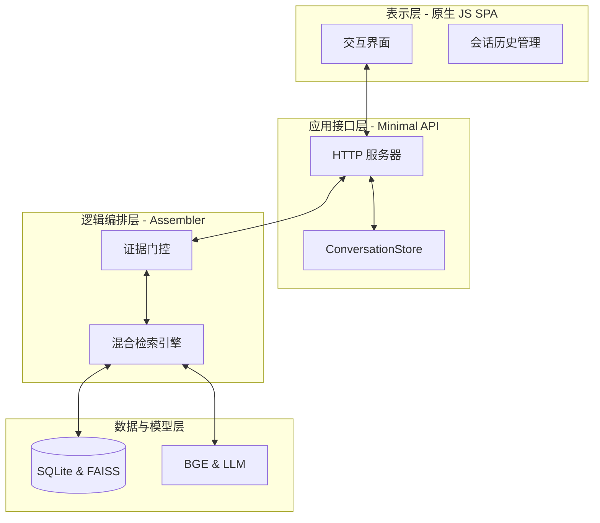
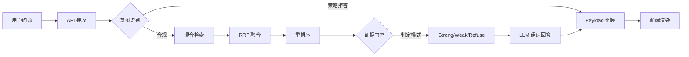

# 第4章 系统设计

## 4.1 系统设计目标与原则

### 4.1.1 设计目标
本系统的核心目标是构建一个针对《伤寒论》单书场景的研读支持系统，通过结构化的证据检索与辅助生成技术，帮助研究者精准定位原文、核对注解并减少理解偏差。系统设计不以“辅助诊断”为目标，而是定位于“文献数字化研读支持”。

具体目标包括：
1. **证据驱动的可靠性**：确保每一条输出均有数据库内的条文或注解支撑，从源头降低模型幻觉风险。
2. **严密的边界控制**：通过证据门控机制，在证据不足或问题越界时实现精准拒答或弱证据提示。
3. **闭环的溯源交互**：实现从回答文本到原始证据卡片的双向联动，支持点击溯源。

### 4.1.2 设计原则
1. **证据优先原则**：回答的组织必须严格依赖检索出的证据，LLM 仅作为语言组织工具，而不作为知识来源。
2. **保守回答策略**：在证据相关度不达标时，系统应优先选择“弱证据提示”或“拒答”，而非强行生成确定性结论。
3. **轻量化实现原则**：后端采用原生 Python 服务，前端采用原生 JavaScript 实现，以保证系统在学术研究环境下的快速部署与低依赖运行。

## 4.2 系统总体架构设计

系统采用分层架构设计，共分为四层，确保了从底层存储到顶层交互的逻辑解耦。

### 4.2.1 系统架构模型
1. **表示层（Frontend SPA）**：
   采用原生 HTML/CSS/Vanilla JS 构建。负责处理用户交互、维护会话状态、渲染带有引用标记的回答，并实现侧边证据栏的同步滚动与高亮。
2. **应用接口层（Minimal API）**：
   基于 Python `ThreadingHTTPServer` 实现。主要职责包括路由分发（如 `/api/v1/answers`）、会话管理（通过 `ConversationStore` 实现持久化）以及请求的预处理。
3. **逻辑编排层（RAG Engine & Assembler）**：
   这是系统的核心，由 `AnswerAssembler` 模块驱动。其职责包括调度混合检索引擎、执行证据门控判定、选择回答模式（Strong/Weak/Refuse）以及组装最终的 Prompt 和 Payload。
4. **数据与模型层（Storage & Models）**：
   底层由 SQLite 数据库存储结构化文本。模型层集成 BGE 嵌入模型执行稠密检索，并调用 LLM API 生成自然语言。

### 表4-1 系统架构分层与真实实现对应表
| 架构层 | 核心职责 | 真实实现模块/文件 |
| :--- | :--- | :--- |
| **表示层** | 交互渲染、引用联动 | `frontend/app.js` |
| **应用接口层** | 路由分发、会话持久化 | `backend/api/minimal_api.py` |
| **逻辑编排层** | 检索调度、证据门控 | `backend/answers/assembler.py` |
| **数据与模型层** | 混合索引、LLM 生成 | `backend/retrieval/hybrid.py`, `backend/llm/` |

### 图4-1 系统总体架构图

## 4.3 知识库与索引设计

### 4.3.1 数据源与结构化存储
系统以《四部丛刊初编》本《注解伤寒论》为基础，构建了结构化知识库。真实数据规模包括 777 条主条文、583 个文本片段及 629 条权威注解。通过统一视图（Unified View）技术，系统管理着 4,280 条可供检索的记录。

### 4.3.2 混合索引架构
1. **稀疏索引**：利用 SQLite FTS5 模块构建。针对中医古籍特征采用三元组（trigram）分词，确保对“桂枝汤”、“脉浮紧”等短关键词的高召回率。
2. **稠密索引**：利用 FAISS 向量库构建。使用 `bge-small-zh-v1.5` 模型对片段进行向量化，主要解决现代汉语提问与古文原文之间的语义关联问题。

## 4.4 在线问答流程设计

在线问答流程遵循“判定-检索-门控-生成”的闭环路径。

### 图4-2 在线问答流程图

## 4.5 混合检索与重排序设计

### 4.5.1 多路召回与 RRF 融合
系统在检索时启动双路并行召回。针对稀疏与稠密检索结果的分值差异，系统采用倒数排名融合（RRF）算法进行统一：
$RRFscore = \sum_{rank \in R} \frac{1}{60 + rank}$
该算法能有效保证在两路检索中均排名靠前的证据被优先选中。

### 4.5.2 交叉编码器重排序
为进一步提升证据精度，系统对初步召回的 Top-24 候选项进行重排序。重排序采用 `bge-reranker-base` 模型，通过对问题与片段进行深度的交叉编码分析，剔除语义无关的干扰项。

## 4.6 证据分层与回答模式控制设计

这是系统的核心防幻觉设计，通过后端逻辑在生成前锁定回答边界。

### 4.6.1 证据分层
系统将检索到的依据分为三个层级：
- **Primary（主依据）**：高相关度、权威正文。
- **Secondary（补充依据）**：辅助条文或注解。
- **Review（核对材料）**：存在歧义的风险条文。

### 4.6.2 回答模式控制
根据证据分布，`AnswerAssembler` 决定以下模式：
- **Strong**：当主依据分值高于阈值且关键实体匹配时触发，输出确定性答案。
- **Weak with Review Notice**：当主依据不足但存在相关材料时触发，强制展示核对提示。
- **Refuse**：未检索到有效证据时触发，直接返回拒答理由与改问建议，不调用 LLM 强答。

### 表4-2 回答模式与证据条件对应表
| 回答模式 | 触发条件 | 证据输出 | 风险控制 |
| :--- | :--- | :--- | :--- |
| **Strong** | Score > 0.65 | 主依据 + 引用标号 | 引用溯源核对 |
| **Weak** | 0.4 < Score <= 0.65 | 补充依据 + 强制核对提示 | 告知证据不足 |
| **Refuse** | Score <= 0.4 | 仅返回建议 | 阻断模型胡编 |

## 4.7 答案生成与引用溯源设计

### 4.7.1 基于规则的 Prompt 组装
LLM 在系统中仅负责将证据整理为自然语言。后端会动态拼接证据槽位（Evidence Slots），要求 LLM 必须在每一条断言后使用 `[E1]` 等标识指明来源。

### 4.7.2 前端引用联动实现
前端 `app.js` 在接收到 Payload 后，会将文本中的 `[E1]` 替换为可点击的交互组件。点击引用标号后，侧边栏证据区会自动滚动到对应的证据卡片位置并触发高亮，实现了“以原文为中心”的闭环研读体验。

## 4.8 前端与接口设计

### 4.8.1 前端工程考量
系统最终未采用 React 框架，而是选择了原生 JavaScript 驱动。这一决策是为了确保在频繁的 DOM 节点交互（如自动滚动、引用高亮联动）中获得最高的性能响应。前端实现了会话管理逻辑，支持搜索历史会话和多会话间的快速切换。

### 4.8.2 核心接口定义
- **POST /api/v1/answers**：核心问答接口，接收 `query`，返回包含 `answer_mode` 和 `citations` 的结构化 JSON。
- **GET /api/v1/conversations**：获取历史会话列表，支撑侧边栏渲染。

## 4.9 可评测性设计

### 4.9.1 黄金测试集规模
系统构建了包含 150 条高质量测试题目的 Goldset。涵盖了方剂比较、条文搜索、释义及拒答四大类常见研读场景。

### 4.9.2 评测指标
系统通过 `scripts/run_evaluator_v2.py` 进行自动化评测。关键指标包括：
- **Hit@5 / Hit@10**：衡量检索环节的召回效果。
- **Mode Match**：衡量后端门控逻辑对回答模式判定的准确率。
- **Citation Pass**：衡量生成文本中引用的合规性。

## 4.10 本章小结

本章系统论述了《伤寒论》研读支持系统的架构设计与实现方案。通过混合检索技术实现了对经典文献的精准召回，并创新性地设计了基于证据门控的回答模式控制机制，有效地在系统层面约束了 LLM 的回答边界。原生 JavaScript 构建的前端界面配合全链路引用溯源设计，为研究者提供了可信、便捷的数字化研读环境。
