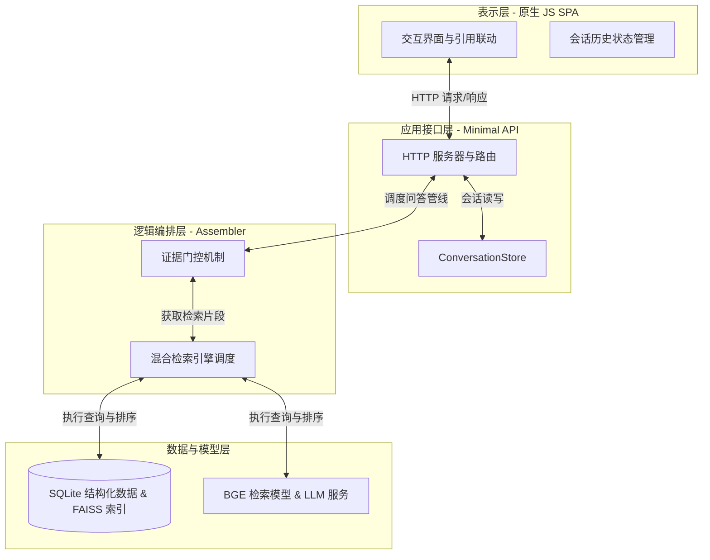
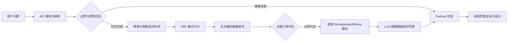

# 第4章 系统设计

## 4.1 系统设计目标与原则

### 4.1.1 设计目标
本系统的核心目标是构建一个针对《伤寒论》单书场景的研读支持系统，通过结构化的证据检索与辅助生成技术，帮助研究者精准定位原文、核对注解并减少理解偏差。系统在设计之初即明确了其功能边界：本系统并非面向临床的“辅助诊断系统”或“医疗决策支持系统”，而是定位于“文献数字化研读支持”。其应用场景主要集中在中医经典理论的学习、文献溯源以及方证对比分析等学术及教学领域。

具体的设计目标包括以下三个方面：
1. **证据驱动的可靠性**：针对大型语言模型（LLM）在生成古代文献时容易产生幻觉、编造原文的缺陷，系统需确保每一条输出均有底层数据库内的具体条文或注解记录作为支撑。从数据源头切断模型自主编造知识的可能，进而提高文献研读过程中的信息可靠性。
2. **严密的边界控制**：为了避免系统在缺乏充分依据时给出误导性建议，系统需设计一套前置的证据门控机制。当检索到的证据相关度不足，或者用户提出的问题超出了《伤寒论》文本的解释范围（例如现代疾病的治疗方案）时，系统能够通过规则进行拦截，实现精准的业务拒答或输出弱证据核对提示。
3. **闭环的溯源交互**：文献研读的核心在于“无证不信”。系统需要在生成的自然语言回答中，建立从文本断言到原始证据卡片的双向联动。研究者可以通过点击回答中的引用标记，直接在界面上定位到对应的原文或注解记录，从而完成“提问-获取回答-核对原文”的闭环交互体验。

### 4.1.2 设计原则
在上述目标的指导下，本系统的架构与功能设计遵循以下原则：
1. **证据优先原则**：在问答流水线中，底层数据检索出的原文与注解记录处于绝对的支配地位。语言大模型仅被作为一种语言组织与编排工具，负责将离散的证据片段转化为符合自然语言阅读习惯的文本，而不被允许作为常识库或知识来源直接回答问题。
2. **保守回答策略**：不同于通用闲聊模型尽力给出答案的倾向，本系统采取保守的回复策略。在检索环节返回的证据相关度评分不达标时，系统不会强行提示 LLM 总结答案，而是优先进入“弱证据提示”模式或“拒答”模式，宁可不提供确定性结论，也不提供可能存在误导的错误解读。
3. **轻量化实现原则**：考虑到系统主要应用于学术研究与经典研读场景，而非具有高并发要求的大型商业平台，系统在技术选型上追求轻量与稳定。后端服务采用原生 Python 库搭建，前端界面采用原生 JavaScript 技术栈实现，减少对复杂第三方框架（如 React 等）的依赖，以保证系统在常规研究环境下的快速部署与低资源消耗运行。

## 4.2 系统总体架构设计

为了实现不同模块职责的清晰划分与后续扩展的便利性，本系统采用分层架构设计。整体系统分为表示层、应用接口层、逻辑编排层以及数据与模型层，通过明确的接口与调用关系，确保了从底层存储到顶层交互的逻辑解耦。

### 4.2.1 系统架构模型
系统的四层架构在请求处理的生命周期中承担着不同的职责：
1. **表示层（Frontend SPA）**：
   表示层采用原生 HTML、CSS 与 Vanilla JavaScript 构建单页应用（SPA）。其核心职责是处理用户的浏览器端交互，包括接收自然语言问题输入、维护当前的会话状态与界面布局。同时，表示层负责解析后端返回的 JSON 数据，将带有引用标记的回答文本渲染到对话区，并根据用户的点击操作，实现侧边证据栏的同步滚动与高亮显示，以此提供沉浸式的研读体验。
2. **应用接口层（Minimal API）**：
   应用接口层基于 Python 的 `ThreadingHTTPServer` 模块实现了一个轻量级的 Web 服务器。它作为前后端通信的桥梁，主要职责包括路由请求的分发（例如处理针对 `/api/v1/answers` 路径的 POST 请求）、解析前端的请求负载，以及响应数据的封装。此外，应用接口层还通过 `ConversationStore` 组件管理会话，将会话历史持久化存储到本地，确保用户刷新页面后能够恢复研读上下文。
3. **逻辑编排层（RAG Engine & Assembler）**：
   逻辑编排层是系统的控制中枢，主要由 `AnswerAssembler` 核心模块及其调度的各个子模块构成。当应用接口层将问题传递至此后，编排层负责整体问答管线的调度：首先调用混合检索引擎获取相关证据，接着执行证据门控逻辑以评估证据质量，进而判定当前请求应当采用的回答模式（如强证据回答、弱证据提示或直接拒答）。最后，根据确定的模式组装发往大模型的 Prompt，并在获取回复后构建最终返回给前端的结构化 Payload。
4. **数据与模型层（Storage & Models）**：
   数据与模型层负责系统的数据持久化与底层计算服务。数据存储方面，采用 SQLite 数据库管理结构化的条文与注解数据；检索索引方面，利用 FTS5 和 FAISS 分别支持全文稀疏检索与稠密向量检索。模型计算方面，集成了基于 BGE 架构的本地嵌入模型与重排序模型执行语义匹配，并通过 API 调用的方式接入大语言模型执行最终的自然语言生成。

### 表4-1 系统架构分层与真实实现对应表
| 架构层 | 核心职责 | 真实实现模块/文件 |
| :--- | :--- | :--- |
| **表示层** | 交互界面渲染、引用联动、状态维护 | `frontend/app.js` 等静态资源 |
| **应用接口层** | HTTP 路由分发、会话数据持久化 | `backend/api/minimal_api.py` |
| **逻辑编排层** | 检索管线调度、证据门控判定、回答组装 | `backend/answers/assembler.py` |
| **数据与模型层** | 结构化存储、混合索引、LLM 生成接入 | `backend/retrieval/hybrid.py`, `backend/llm/` 等 |

### 图4-1 系统总体架构图

## 4.3 知识库与索引设计

系统的检索性能和回答质量高度依赖于底层知识库的构建质量。在本系统中，离线数据的预处理、结构化入库以及多种索引的构建构成了 RAG 架构的基础。

### 4.3.1 数据源与结构化存储设计
系统的核心数据源严格限定为《四部丛刊初编》本《注解伤寒论》。在离线处理阶段，原始文本经过清洗与切分，形成了结构化的数据表。真实的数据规模包括 777 条主条文（主要记录原文的核心方证与论述）、583 个文本片段（用于承载长文本的切分单元）及 629 条注解记录（主要为成无己的批注）。为了便于在检索环节进行统一的调度和打分，系统通过在 SQLite 中构建统一视图（Unified View）技术，将不同类型的文本数据进行整合，最终管理着 4,280 条可供检索引擎统一查询的记录。

为了保证系统在后续测试和在线运行过程中的可控性，离线流程还包含了一个“安全数据集（Safe Dataset）”的抽取过程。该子集在离线构建时剔除了一些高度模糊或可能引发系统拒答误判的边缘数据，为在线系统提供了一个更为纯净和稳定的核心知识底座。

### 4.3.2 FTS5 与 FAISS 混合索引的设计意义
为了应对中医古籍文本中既包含高度凝练的专有名词，又需要与现代汉语提问进行语义映射的复杂情况，系统构建了两套并行的检索索引：
1. **基于 FTS5 的稀疏索引**：利用 SQLite 的 FTS5 模块构建全文搜索能力。在设计上，针对中医古籍的文本特征，系统采用了三元组（trigram）的分词策略。这种设计的意义在于，它能够无视古汉语中复杂的词性边界，通过字符片段的直接匹配，确保针对如“桂枝汤”、“脉浮紧”等短关键词和特定方药名称时具有极高的精确匹配召回率，防止核心专有名词的丢失。
2. **基于 FAISS 的稠密索引**：利用 FAISS 向量库构建稠密检索能力。系统使用 `bge-small-zh-v1.5` 模型对所有的条文和片段进行高维向量化。其核心意义在于解决自然语言提问（如“发热怕冷怎么办”）与古文原文（如“太阳病，发热汗出，恶风”）之间的语义鸿沟。稠密索引能够捕捉到字面之外的语义相似性，从而提高泛化场景下的召回能力。

## 4.4 在线问答流程设计

当用户在前端界面提交一个研读问题时，系统会启动一条完整的在线问答流水线。该流水线遵循“判定意图-检索证据-门控评估-组装生成”的闭环路径，以确保每一步的处理都在可控范围之内。

### 4.4.1 在线问答各步骤职责
1. **意图识别与预处理**：应用接口层接收到请求后，首先将提问文本传递给逻辑编排层。系统利用内置的规则对问题意图进行初步识别，判断该问题是否属于系统明确支持的经典研读范畴。如果问题命中了预设的策略拦截规则（例如询问非《伤寒论》范围的现代疾病或常识），系统将直接走拒答分支，终止后续的高昂计算。
2. **混合检索与排序**：对于合规的提问，系统并行调用稀疏索引和稠密索引，从数据库中提取出初步相关的片段集合。随后，这些片段需要经过得分融合和深度的二次排序，以提升顶部证据的相关性。
3. **证据门控判定**：重排序后的高分片段并不会直接投递给大模型。门控机制会根据候选证据的得分分布、来源类型（主条文还是注解记录）进行评估，从而决定当前回答所应采用的模式（强依据、弱依据或拒绝回答）。
4. **组装生成与渲染**：根据确定的回答模式，系统从模板中加载对应的 Prompt，将核心证据嵌入槽位中，并发送给 LLM 进行语言整理。LLM 返回带引用标记的回答后，系统将其与原始证据的详细信息一起封装为 Payload 结构返回给前端，前端解析后渲染至对话区，更新阅读视图。

### 图4-2 在线问答流程图

## 4.5 混合检索与重排序设计

由于单一的检索方式在中医文献领域容易出现固有的缺陷（如稀疏检索易漏召回语义相似项，稠密检索易在字面相似的名词上发生混淆），系统设计了混合检索与重排序的漏斗式架构。

### 4.5.1 混合检索与 RRF 融合的设计考量
混合检索的目的是兼顾查准率（依赖 FTS5 精确匹配核心术语）与查全率（依赖 FAISS 向量匹配语义相近的内容）。然而，稀疏检索的 BM25 分数与稠密检索的余弦相似度分数在量纲上完全不同，无法直接通过相加来进行综合排序。

为了解决这一问题，系统在检索融合阶段引入了倒数排名融合（RRF, Reciprocal Rank Fusion）算法。该算法不依赖于两路检索输出的绝对分值，而是基于片段在各路检索结果中的排名位置进行融合计算：
$RRFscore = \sum_{rank \in R} \frac{1}{60 + rank}$
采用 RRF 算法的意义在于，它能够将多个检索维度的相对优势进行平滑结合。如果某一条文在 FTS5 和 FAISS 的召回结果中均排名靠前，其最终的 RRF 分数将显著提升，从而被确认为高质量候选证据。

### 4.5.2 交叉编码器（Reranker）的引入
经过 RRF 融合后，系统通常会保留 Top-24 的候选项。但在 RAG 架构中，初筛阶段的向量模型由于采用的是双编码器（Bi-encoder）分别计算问题和片段的向量，在处理复杂的上下文逻辑时可能出现偏差。

为了进一步提升提交给门控机制的证据精度，系统引入了 `bge-reranker-base` 交叉编码器模型进行重排序。交叉编码器将用户问题与每一个候选片段拼接在一起，进行深度的交互注意力计算。这一步骤能够有效识别并剔除那些虽然包含部分关键词但实际语境与问题无关的干扰片段，从而确保最终进入证据门控环节的片段具有较高的相关性。

## 4.6 证据分层与回答模式控制设计

证据分层与回答模式控制（Evidence Gating）是系统防范大模型幻觉的核心设计。通过在后端代码中硬编码的规则逻辑，系统在生成之前就锁定了回答的边界。

### 4.6.1 证据的角色分层
在重排序完成后，系统不会将所有片段不加区分地发送给大模型，而是根据片段的元数据类型与相关度分值，将其划分为三个明确的层级：
1. **Primary Evidence（主依据）**：主要来源于《伤寒论》原文的核心条文，且与用户问题具有高度的相关性得分。这是支撑系统给出明确结论的基石。
2. **Secondary Evidence（补充依据）**：包含了相关的注解记录或得分稍次的辅助条文。它们在回答中用于提供背景信息和解释说明，但不单独作为确诊性的依据。
3. **Review Materials（核对材料）**：指那些在检索中被召回，但存在歧义风险或属于边缘异文的片段。这类材料被隔离在主回答逻辑之外，仅作为侧边栏中的参考内容供用户自行对照阅读。

### 4.6.2 回答模式（Answer Mode）的分级控制
在对证据完成分层和评分后，`AnswerAssembler` 会基于预设的逻辑规则计算当前证据的整体质量，并强制系统进入以下三种回答模式之一。这一设计的关键在于，回答的可靠性判定由后端的检索分值和规则决定，而不是交给大模型自行判断，从而避免了模型自行编造的风险。

1. **Strong 模式（强证据回答）**：
   当检索到的 Primary（主依据）分值高于系统设定阈值，且关键实体与提问高度匹配时，系统触发此模式。此时系统认为证据充分，通过对应的 Prompt 模板指示 LLM 基于主依据组织确定性的回答文本。
2. **Weak with Review Notice 模式（弱证据提示）**：
   如果主依据缺失，或者最高分值处于系统设定的中等阈值区间，说明当前召回的片段多为补充依据或注解记录，支撑力不足。此时系统进入弱证据模式，强行在输出回答中注入“核对提示”，并限制 LLM 使用绝对肯定的语气。此举有效提醒用户，当前回答仅作为线索参考。
3. **Refuse 模式（业务拒答）**：
   当所有候选证据的得分均低于系统设定阈值的最低界限，或问题命中了系统的敏感过滤规则时，系统判定为无有效依据。此时，系统彻底切断 LLM 的生成流程，直接返回预设的拒答说明文本及修改提问的建议。这种机制从根本上阻断了模型在无证据下的生成尝试。

### 表4-2 回答模式与证据条件对应表
| 回答模式 | 触发条件 | 证据输出组合 | 风险控制作用 |
| :--- | :--- | :--- | :--- |
| **Strong** | 检索分值 > 系统设定高阈值 | 主依据 + 补充依据 + 引用标号 | 结论可靠，支持引用溯源核对 |
| **Weak** | 系统设定低阈值 < Score <= 系统设定高阈值 | 补充依据 + 强制核对提示 | 告知证据不足，防范误导风险 |
| **Refuse** | Score <= 系统设定低阈值 或命中阻断规则 | 仅返回业务拒答原因与建议 | 彻底阻断模型在无证据时的编造行为 |

## 4.7 答案生成与引用溯源设计

在证据质量得到控制之后，生成环节的重点在于如何保证回答文本与后台证据之间的可追溯性。

### 4.7.1 基于规则的 Prompt 组装与约束
在大模型的调用环节，系统采用了基于槽位（Evidence Slots）的模板组装技术。经过门控筛选的证据片段被分配了特定的编号，并连同用户提问一起注入到 Prompt 模板中。
模板内包含严格的指令约束，要求大模型在组织自然语言回答时，不仅需要准确概括提供的内容，还必须在涉及具体断言的句子末尾，使用特定的标记（如 `[E1]`, `[E2]`）对信息来源进行引用标注。大模型在此环节的职责被明确限制为阅读理解与文本整理。

### 4.7.2 前端引用卡片的联动实现
为了将溯源机制落地到用户交互层面，系统在前后端数据的传输与解析上进行了针对性设计。后端生成的 JSON Payload 中不仅包含了带有 `[E1]` 等标记的 `answer_text` 字符串，还专门设有一个 `citations` 数组结构，完整保存了每个标记对应的证据正文与元数据信息。
在前端 `app.js` 的渲染过程中，解析器会识别回答文本中的引用标记，并将其转换为可交互的 HTML 元素。当研究者在阅读回答时点击某处引用标号，前端界面会触发视图更新，使侧边栏的证据列表平滑滚动到对应的证据卡片位置，并触发高亮显示效果。这种闭环交互设计支持了“以文寻证”的研读需求。

## 4.8 前端与接口设计

### 4.8.1 前端技术选型与工程考量
在项目早期的架构规划中，曾考虑采用现代前端框架进行构建。然而在实际的原型开发过程中，考虑到本系统的核心交互集中在长文本的展示、侧边栏证据卡片的频繁滚动以及引用标记的 DOM 定位联动。
作为一种工程层面的折中与取舍，系统最终决定放弃复杂的现代框架，转而采用原生 HTML、CSS 与 Vanilla JavaScript 进行前端单页应用（SPA）的开发。这种设计的考量主要基于两点：一是原生实现能够较好地处理大段古籍文本展示和跨区域的高亮联动，使开发者能够更直接地控制元素的滚动行为；二是避免了复杂的打包流水线，使得前端静态资源可以直接交由 Python 的内置服务器托管，降低了整体项目的部署难度与环境依赖。

### 4.8.2 核心接口定义与会话机制
后端的 Minimal API 提供了一组明确的 HTTP 接口用于支撑前端的交互需求。其中，核心的问答接口定义为 `POST /api/v1/answers`，前端向该路径提交包含 `query` 的负载，并在处理完成后接收包含 `answer_mode`、`answer_text` 以及 `citations` 等字段的结构化 JSON 响应。

在会话支持方面，系统提供了 `GET /api/v1/conversations` 等接口来获取历史会话数据。前端通过发送请求获取会话列表，并在界面上呈现历史会话切换菜单。通过在每次请求中携带相应的会话标识，系统支持用户在不同的历史记录之间进行快速切换查看。

## 4.9 可评测性设计

系统的设计充分考虑了迭代过程中对系统能力的自动化验证。为了能够定量评估检索组件与证据门控机制的有效性，系统内置了对可评测性的支持。

### 4.9.1 黄金测试集的构建与结构
系统构建了一个包含约 150 条高质量测试题目的黄金测试集（Goldset）。该测试集的用例覆盖了方剂构成对比、原文出处检索、医学术语释义以及超出领域边界的挑战性提问等常见的研读场景。在构建该数据集时，对每一道测试题进行了标准化的答案标注，主要包括对应问题应当召回的黄金引用（Gold Citations）片段 ID，以及在理想状态下该问题应该触发的正确回答模式。

### 4.9.2 多维度的评测指标体系
通过内置的评估模块，系统能够在离线状态下运行测试集，并从多个维度输出评测结果，以指导后续的调优：
1. **召回指标（Hit@5 / Hit@10）**：主要用于考察底层的混合检索引擎与重排序模型能否在极少的候选名额内，成功包含标注的黄金证据片段。这一指标直接反映了检索管线的有效性。
2. **回答模式匹配率（Mode Match）**：用于考察逻辑编排层的证据门控机制。通过对比系统自动判定的回答模式与测试集人工标注的期望模式是否一致，评估系统在应对不同质量证据时的判定准确性。
3. **引用合规性检查（Citation Pass）**：针对生成环节，评估脚本检查输出文本中是否包含了引用标记，并验证这些标记是否真实映射到了系统下发的可用证据范围内，以监控和量化大模型出现未授权引用的发生频率。
这种自动化评估的设计使得系统在每次更新配置或更换模型时，都能够具备客观的基准对照。

## 4.10 本章小结

本章详细介绍了《伤寒论》研读支持系统的架构设计方案。系统在思路上坚守“证据优先”与“边界控制”的原则，通过四层的分层架构实现了逻辑解耦。针对古籍研读场景，系统采用了稀疏索引与稠密索引相结合的混合检索方案，并通过 RRF 与交叉编码器重排序提升了证据获取精度。作为系统的核心机制，后端的证据分层与门控逻辑在提交给大模型生成前确立了强依据、弱依据和拒答三种控制模式，从而限制了模型幻觉的空间。此外，轻量化的前端实现配合闭环的引用联动，为用户提供了可信赖的数字研读环境。系统的可评测性设计则保障了后期迭代过程中的质量把控与客观分析。